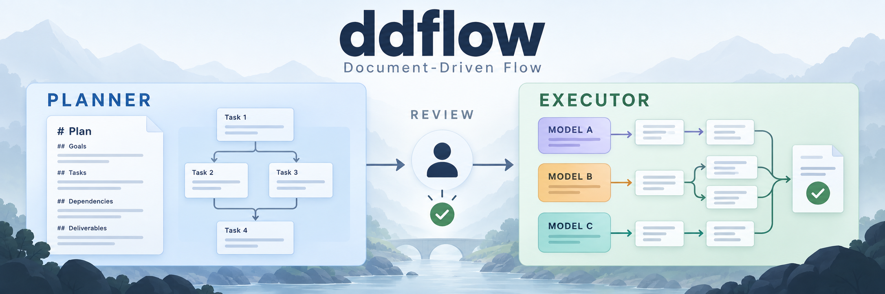

# DDFlow: Document-Driven Flow

[](https://github.com/Bin-Zhang-hhht/DDFlow/actions/workflows/verify.yml?query=branch%3Amain) [](https://github.com/Bin-Zhang-hhht/DDFlow/releases/latest) [](LICENSE)

面向多来源数据清洗与整理的 Agent 工作流 Skill。ddflow 将长任务拆成可检查的 Markdown 计划，用明确的模型分工执行，以实际产物验收，让任务从输入、处理到交付都有据可查。

Document-Driven Flow: explicit plans, model assignments, and verifiable deliverables for long agent workflows.

[快速开始](#快速开始) · [电商案例](docs/online-retail.md) · [产品文档](docs/product.md) · [架构文档](docs/architecture.md) · [使用手册](docs/usage.md)



## 能力与体验

ddflow 适合输入明确、包含多个处理步骤、需要复核结果的任务，例如统一多份交易表的字段和格式，核对异常，交付标准表、来源映射与质量报告。

- **先检查计划**：Planner 写清目标、依赖、输入输出、模型和验收标准，用户检查后再启动 Executor。
- **按约定执行**：由宿主派发 Agent 任务，指定模型不静默替换，原始数据只读，业务产物写入约定目录。
- **以产物验收**：验收通过才记录完成；失败保留原因，停止启动新任务，继续时显式重新规划。
- **随时查看进展**：Markdown 保存计划与执行事实；CLI 检查结构，Viewer 展示依赖图、节点正文和诊断。

两个 Skill 由用户分别调用。实际模型与工具能力由宿主提供，极短任务或尚无验收标准的开放探索通常无需拆成工作流。

## 快速开始

### 1. 安装两个 Skill 和 CLI

**把下面这段话复制给你的 AI，让它帮你完成安装。** 请使用能访问本地文件、执行命令的 AI 编程助手。

```text
请帮我安装 ddflow 的 Planner、Executor 两个 Skill，以及同版本的 CLI（包含 Viewer）。
项目地址：https://github.com/Bin-Zhang-hhht/DDFlow
优先使用我提供的本地源码或分发包，否则从项目获取可用版本；告诉我实际安装的版本和来源。
先阅读该版本的 docs/usage.md 和 docs/architecture.md，识别当前 AI 宿主，按文档安装到对应技能目录；无法识别时问我。
使用完整的双 Skill 包和 CLI 包并核对 SHA256SUMS；如果只有源码，按文档构建分发包，不直接复制源码 Skill 目录。
检查 CLI 所需的 Node.js 环境，按使用手册安装项目构建的 CLI 包，不安装 npm 上的同名包。
发现已有安装时，先告诉我安装位置与版本，确认后再更新。
完成后检查两个 Skill 的入口和随包引用文件，运行 ddflow --help 验证 CLI，告诉我安装路径，以及如何刷新宿主、调用 Skill 和打开 Viewer。
```

当前版本为 **v0.0.0**，安装包见 [GitHub Releases](https://github.com/Bin-Zhang-hhht/DDFlow/releases/tag/v0.0.0)。已有本地源码或分发包时，把位置一并告诉 AI。默认一并安装两个 Skill 和 CLI；CLI 需要 Node.js，两个 Skill 仍可独立使用。手动操作见[安装说明](docs/usage.md#安装两个-skill)。

目标宿主为 Codex 和 ZCode。Codex 已有部分发现与执行验证，ZCode 原生安装发现和执行尚未验证；详见[宿主兼容说明](docs/usage.md#宿主差异与已知限制)。

### 2. 生成并检查计划

在仓库外的业务工作区中，将占位符换成实际路径与可用模型，显式调用 Planner：

```text
$ddflow-planner
请在 <工作区绝对路径> 规划一次交易数据整理任务。
输入：<原始数据目录>，所有原始文件只读。
交付：标准交易表、来源映射、异常清单和质量报告。
验收：每条输入记录都有去向，合并或排除有依据，金额汇总可核对。
可用模型：<宿主实际支持的模型>。
请先澄清缺少的业务规则，只生成计划，完成后停止。
```

检查生成的 `workflow.md` 和 `nodes/*.md`，确认任务范围、依赖、模型、产物路径与验收要求。

### 3. 执行并检查结果

确认计划后，另行发送：

```text
$ddflow-executor
请执行 <工作流目录绝对路径> 中的计划，验收实际产物并记录结果。
```

查看节点 `Result` 中的产物位置与验收证据，失败原因记录在 `Error`。完整输入说明与提示词见[电商交易案例](docs/online-retail.md)；该案例为教程，业务执行尚未验证。

### 查看工作流

调用 Planner 或 Executor 时，会在工作流文档就绪后默认尝试启动 Viewer，并返回实际访问地址；未安装 CLI 就直接跳过。也可以单独把这段话发给 AI：

```text
请为 <工作流目录绝对路径> 启动 ddflow view，告诉我实际访问地址和停止服务的方法。
```

Viewer 启动失败不阻塞任务；不需要时可直接告诉 AI 不启动。CLI 与 Viewer 都只读，结构检查不能代替业务验收。环境要求、手动安装与卸载见[使用手册](docs/usage.md#安装-cli)。

## 项目结构

```text
.
├── skills/
│   ├── ddflow-planner/       # 规划入口与宿主配置
│   ├── ddflow-executor/      # 执行入口与宿主配置
│   └── protocol/             # Schema、执行协议与规划指南
├── src/
│   ├── workflow/             # 解析、校验与静态依赖计算
│   ├── viewer/               # 本地只读服务与 Web 界面
│   └── cli.ts                # inspect / view 入口
├── scripts/                  # Skill 组装与双包构建
├── tests/                    # 产品、Skill 独立安装与分发检查
├── .github/workflows/        # 自动验证与候选包构建
└── docs/                     # 产品、架构、使用、案例与图片
```

三份运行协议仅在 `skills/protocol/` 维护，构建时复制到每个 Skill 的 `references/`。业务工作流、数据与执行产物存放在用户指定的仓库外目录。

## 技术栈

Markdown · YAML · Agent Skills · Node.js · TypeScript · React · Vite · React Flow · Dagre · Chokidar · GitHub Actions

## 数据与许可

代码与文档采用 [MIT License](LICENSE)。业务数据、专用处理代码、运行记录和数据处理成果不随软件分发，也不属于本项目许可证的授权范围。原始输入保持只读，业务执行与验收在约定的数据目录内完成。
